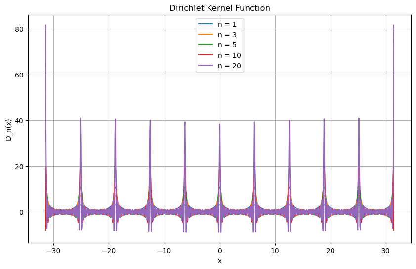

# Dirichlet Kernel Visualization

This repository contains a Jupyter Notebook (`dirichlet.ipynb`) for visualizing the Dirichlet kernel function.

## Usage

To visualize the Dirichlet kernel function, follow these steps:

1. Clone this repository:
    ```bash
    git clone https://github.com/your-repo/dirichlet-visualization.git
    cd dirichlet-visualization
    ```

2. Ensure you have the necessary Python packages installed:
    ```bash
    pip install numpy matplotlib jupyter
    ```

3. Open the Jupyter Notebook:
    ```bash
    jupyter notebook dirichlet.ipynb
    ```

4. Run the notebook cells to generate the Dirichlet kernel plots.

## Function Definition

The Dirichlet kernel function is defined as:

\[ D_n(x) = \frac{\sin((n + 0.5)x)}{\sin(0.5x)} \]

## Example Plot

Below is an example plot generated by the notebook:


